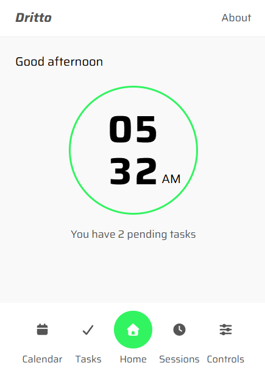
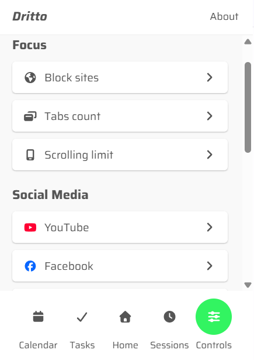

<div align="center">
  <h1>Dritto</h1>
  
  <b><p>Product = Work - Distraction</p></b>

  
  
  
  
</div>

## Overview

A productivity-focused browser extension designed to help you stay focused and minimize distractions online.

⚠️ This project is actively **under development**. Features may change and some functionality may be incomplete.

## Preview

<table>
  <tr align="center">
    <td width="33%">
      Home Tab
    </td>
    <td width="33%">
      Controls Tab
    </td>
    <td width="33%">
      Temp
    </td>
  </tr>
  <tr align="center">
    <td>
      
    </td>
    <td>
      
    </td>
    <td>
      
    </td>
  </tr>
  <tr align="center">
    <td>
      Temp
    </td>
    <td>
      Temp
    </td>
    <td>
      Temp
    </td>
  </tr>
  <tr align="center">
    <td>
      
    </td>
    <td>
      
    </td>
    <td>
      
    </td>
  </tr>
</table>

## Why Dritto?

**Dritto** is a browser extension designed to improve productivity and reduce digital distractions.

The idea came from the developer’s personal experience with excessive time spent on social media and unfocused browsing. Dritto aims to create a more focused and structured workflow by combining productivity tools with powerful distraction controls.

The name "Dritto" (Italian for "straight") reflects the goal of helping users stay on track and maintain a clear, distraction-free path while working.

## Features

### Productivity Tools 🚀

- **Pomodoro Timer**
- **To-Do List**
- **Calendar**
- **Clock & Timer**

### Distraction Controls & Customization 🎯

#### Site & Domain Management

- **Advanced Website Blocking** (domain & page-level)
- **Customizable Tab Limiting** - Set limits on the number of tabs you can open simultaneously

#### Scrolling Control

- **Scrolling Limits** - Reduce infinite scrolling on addictive websites

#### Social Media Management

- **Facebook**, **Instagram**, **LinkedIn**, **TikTok**, **Twitter**/**X**, **YouTube**, **Pinterest** customizations

#### Settings Management

- **Import/Export Settings** - Backup and restore your preferences across browsers or devices
- **Reset Settings** - Quick reset to default configuration

## Getting Started

### Prerequisites

- Node.js (v16 or higher)
- npm or yarn package manager
- A modern browser (Chrome, Firefox, Edge, etc.)

### Installation

1. **Clone the repository**

   ```bash
   git clone https://github.com/muhammad-ahmed-gh/dritto.git
   cd dritto
   ```

2. **Install dependencies**

   ```bash
   npm install
   ```

3. **Development Build**

   ```bash
   npm run dev
   ```

4. **Production Build**
   ```bash
   npm run build
   ```

### Loading the Extension

#### Chrome/Brave/Edge

1. Open `chrome://extensions/` (or your browser's extensions page)
2. Enable "Developer mode"
3. Click "Load unpacked"
4. Select the `dist` folder from the project directory

#### Firefox

1. Open `about:debugging`
2. Click "This Firefox"
3. Click "Load Temporary Add-on"
4. Select the `manifest.json` file from the `public` folder

## Project Structure

```
dritto/
├── src/
│   ├── app/                 # Main React application
│   ├── components/          # React components
│   │   ├── Controls/        # Distraction control settings
│   │   ├── About.tsx        # About page
│   │   ├── Calendar.tsx     # Calendar component
│   │   ├── Clock.tsx        # Clock display
│   │   ├── Content.tsx      # Main content area
│   │   ├── Footer.tsx       # Footer component
│   │   ├── Header.tsx       # Header component
│   │   ├── Home.tsx         # Home page
│   │   ├── Pomodoro.tsx     # Pomodoro timer
│   │   └── Tasks.tsx        # To-do list
│   ├── background/          # Extension background script
│   ├── content/             # Content script for page injection
│   ├── data/                # Configuration and static data
│   ├── styles/              # Global styles
│   └── types/               # TypeScript type definitions
├── public/                  # Static assets and manifest
├── package.json             # Project dependencies
├── vite.config.ts          # Vite configuration
├── tsconfig.json           # TypeScript configuration
└── eslint.config.js        # ESLint configuration
```

## Technologies

- **React 18** - UI framework
- **TypeScript** - Type-safe development
- **Vite** - Lightning-fast build tool
- **Tailwind CSS** - Utility-first CSS styling
- **Web Extensions API** - Browser extension functionality

## Available Scripts

- `npm run dev` - Start development server with hot reload
- `npm run build` - Create optimized production build
- `npm run lint` - Run ESLint to check code quality
- `npm run preview` - Preview production build locally

## How It Works

Dritto uses background and content scripts to manage your browsing rules. Your preferences are stored in the browser's local storage and can be exported/imported for backup.

## Contributing

Contributions are welcome! To contribute:

1. Fork the repository
2. Create a feature branch (`git checkout -b feature/amazing-feature`)
3. Commit your changes (`git commit -m 'Add amazing feature'`)
4. Push to the branch (`git push origin feature/amazing-feature`)
5. Open a Pull Request

Please ensure your code follows the project's ESLint rules and includes proper TypeScript typing.

## License

MIT License - see the [LICENSE](LICENSE) file for details.

---

Found a bug or have a feature request? Please [open an issue](https://github.com/muhammad-ahmed-gh/dritto/issues) on GitHub.

Built with 💚 by Muhammad Ahmed © 2026
